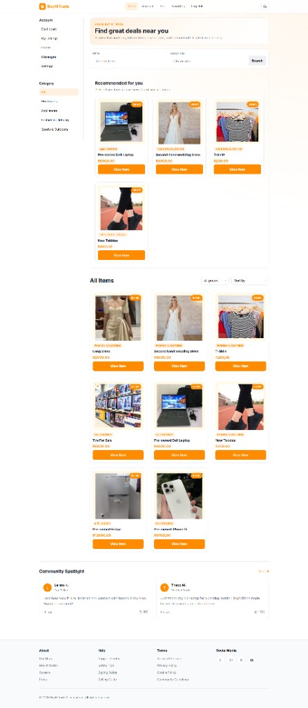
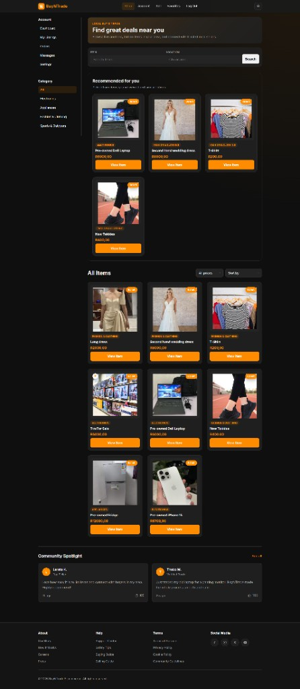
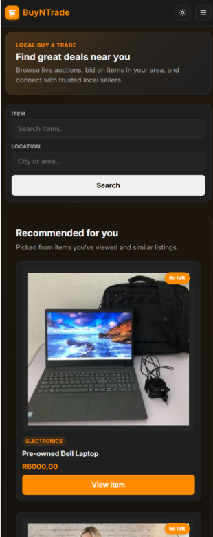

# BuyNTrade

## Project Overview

**BuyNTrade** is a full-stack e-commerce and auction marketplace built with Django. It connects local buyers and sellers across South Africa, allowing users to browse items, place bids on live auctions, sell products, save favorites, message sellers and manage orders from a modern web interface.

The platform uses a **Shop · Sell · Favorites · Account** navigation model, displays prices in South African Rand (`R{amount},00`), and supports both **light and dark themes**.

---

## Purpose of the Project

BuyNTrade was created to demonstrate real-world web development skills using Django while solving a practical problem: making local buy-and-trade simple, transparent and trustworthy.

The project aims to:

- Provide a **local marketplace** where users can list and discover items near them
- Simulate **auction-style commerce** with timed listings, bids and winners
- Teach **full-stack development** - models, views, templates, authentication, file uploads and client-side interactivity
- Deliver a **portfolio-ready application** with polished UI, responsive design, and clear user workflows

---

## Features

- **User Authentication** — Register, log in, log out, and protected routes
- **Marketplace**  Shop homepage with product grids, hero section, and community spotlight
- **Product Listings**  Create, edit, close and manage seller listings with photos and video
- **Product Details**  Gallery, bids, seller info, favorites, messaging and recommendations
- **Categories**  Filter by Electronics, Appliances, Fashion & Clothing Sports & Outdoors
- **Search & Filtering**  Search by item name/description and location
- **Watchlist (Favorites)**  Save listings and view them on a dedicated Favorites page
- **Comments**  Public Q&A on listing pages
- **Bidding System** Place bids, track highest bid, auto-close expired auctions
- **User Profiles**  Seller profiles with ratings, reviews and items for sale
- **Responsive Design** Desktop shop layout and mobile-friendly navigation
- **Django Admin**  Manage listings, categories, bids, messages, reviews and community posts

### Additional features

- Private **messaging** between buyers and sellers
- **Orders** page for won listings
- **Product recommendations** based on category, price, brand, and browsing history
- **Community spotlight** with likes
- **Dark / light mode** toggle
- **Pagination**  9 listings per page with Previous/Next controls

---

## Technologies Used

- **Python** — Backend language
- **Django** — Web framework (MTV pattern, ORM, auth, admin)
- **HTML** — Server-rendered templates
- **CSS** — Custom stylesheet with CSS variables and responsive breakpoints
- **JavaScript** — Theme toggle, shop filters, gallery, mobile nav, video thumbnail extraction
- **SQLite** — Development database
- **Pillow** — Image handling for uploads

---

## Project Structure

```
BuyNTrade E-Commerce/
├── commerce/                    # Django project configuration
│   ├── settings.py              # Settings, DB, static/media, auth
│   ├── urls.py                  # Root URL routing
│   ├── wsgi.py
│   └── asgi.py
├── buyntrade/                   # Main application
│   ├── models.py                # Database models
│   ├── views.py                 # View functions and helpers
│   ├── urls.py                  # App URL patterns
│   ├── admin.py                 # Django admin registration
│   ├── recommendations.py       # Product recommendation engine
│   ├── context_processors.py    # Global template context (site name)
│   ├── migrations/              # Database migrations
│   ├── templates/buyntrade/     # HTML templates
│   └── static/buyntrade/        # CSS, JS, favicon
│       ├── styles.css
│       ├── theme.js
│       ├── shop.js
│       ├── nav.js
│       ├── gallery.js
│       └── create.js
├── docs/
│   └── screenshots/             # README screenshots
├── media/                       # User uploads (created at runtime)
├── db.sqlite3                   # SQLite database
├── manage.py
└── README.md
```

---

## Database Models

### Core models (as specified)

| Model | Description |
|-------|-------------|
| **User** | Custom user extending `AbstractUser`; profile photo, bio, seller ratings |
| **Listing** | Product/auction item — title, description, price, media, category, brand, area, active status, end time, winner |
| **Category** | Product category name |
| **Bid** | Bid amount linked to a listing and bidder |
| **Comment** | Public comment on a listing |
| **Watchlist** | Implemented as a `ManyToManyField` on `Listing` (`listing.watchlist`) — users save favorites |

### Supporting models

| Model | Description |
|-------|-------------|
| **ListingImage** | Gallery photos for a listing (up to 8) |
| **Message** | Private messages between users about a listing |
| **SellerReview** | Buyer review and star rating for a seller after a won listing |
| **ListingViewHistory** | Tracks viewed listings for recommendations |
| **CommunityPost** | Community spotlight / feed posts |

### Entity relationships (summary)

```
User ──owns──> Listing ──has──> Bid, Comment, ListingImage
Listing ──belongs to──> Category
User ──saves──> Listing (watchlist / favorites)
User ──wins──> Listing (winner)
User ──reviews──> User (SellerReview)
User ──messages──> User (via Message + Listing)
```

---

## Application Workflow

1. **Visitor** browses the Shop homepage without logging in.
2. **User registers** or logs in to sell, bid, favorite items, and message sellers.
3. **Seller** clicks **Sell**, uploads photos/video, sets starting bid, category, brand, and area.
4. **Buyer** searches or filters listings, opens a product, adds to **Favorites**, places a **bid**, or sends a **message**.
5. **Auction ends** when the seller closes it or the timer expires — highest bidder wins.
6. **Winner** sees the item under **Orders**; seller manages listings under **My Listings**.
7. **Buyer** can leave a **seller review** after winning.
8. **Recommendations** appear based on browsing history and item similarity.

---

## Authentication System

- Built on Django’s **`AbstractUser`** with a custom **`buyntrade.User`** model
- **Register** — username, email, password, confirmation
- **Login / Logout** — session-based authentication
- **`@login_required`** protects sell, bid, favorites, dashboard, orders, messages, and settings views
- **`LOGIN_URL = 'login'`** redirects unauthenticated users to the login page
- Password validators enforce minimum length and common-password checks

---

## Marketplace Features

- **Shop homepage** (`/`) — hero, dual search bar (item + location), recommendations, product grid, community spotlight
- **Sticky sidebar** — category links and price filter stay fixed while scrolling (desktop)
- **Product cards** — image, category, brand, area, price, time-left badge, favorite indicator
- **Pagination** — 9 items per page, server-side via Django `Paginator`
- **Category pages** — `/categories/<id>` with the same search and filter sidebar
- **Seller profiles** — public page at `/seller/<username>/`

---

## Product Management (CRUD)

| Action | Route | Access |
|--------|-------|--------|
| **Create** | `/create` | Logged-in users |
| **Read** | `/listing/<id>` | Public |
| **Update** | `/listing/<id>/edit` | Listing owner only |
| **Delete/Close** | `/listing/<id>/close` | Listing owner only |

**Create / edit supports:**

- Title, description, starting bid, brand, city/area
- Up to 8 gallery images (5 MB each)
- Optional video snippet (~5 seconds, 10 MB max) with auto-generated thumbnail
- Category and auction duration (3, 5, 7, or 14 days)
- Optional fallback image URL

**My Listings** (`/my-listings/`) shows all seller listings with edit and close actions.

---

## Search and Categories

### Search

- **Item search** (`?q=`) — matches title, description, category, brand, and area
- **Location search** (`?location=`) — filters by listing area (city/suburb)

### Categories

Seeded categories:

- Electronics
- Appliances
- Fashion & Clothing
- Sports & Outdoors

Categories appear in the **left sidebar** on shop pages. Users can also browse via `/categories/<id>`.

### Client-side filters (`shop.js`)

- Price range slider
- Quick filters (Under R100, Under R500)
- Sort by price or name (current page only)

---

## Watchlist System

The watchlist is exposed in the UI as **Favorites**.

- **Add / Remove** — button on listing detail page
- **View all** — `/watchlist` (Favorites page)
- **Storage** — Django `ManyToManyField` between `Listing` and `User`
- **Visual indicator** — heart badge on favorited product cards
- **Dashboard stat** — favorites count with link to Favorites page

---

## Bidding System

- Only **logged-in users** who are **not the seller** can bid
- Bid must be **higher than the starting bid** and any existing highest bid
- **Highest bid** displayed on listing page with bidder username
- **Seller** can manually close the listing — highest bidder becomes `winner`
- **Timed auctions** — listings auto-close when `ends_at` is reached
- **Race protection** — database transaction locking on bid submission
- Clear error messages for invalid bids, ended auctions, and outbid attempts

---

## Comment System

- Public comments on listing detail pages
- Any logged-in user can post a comment
- Comments show **commenter username** and text
- Stored in the **Comment** model with automatic timestamp
- Useful for buyers to ask questions before bidding

---

## User Profiles

### Account dashboard (`/dashboard/`)

- Items for sale, favorites count, bids placed, won items
- Quick links to Sell and My Listings

### Settings (`/settings/`)

- Profile photo upload (max 2 MB)
- Bio (max 500 characters)

### Seller profile (`/seller/<username>/`)

- Profile photo or initial, bio, join date
- Stats: total listings, products sold, average rating
- Items for sale grid
- Buyer reviews
- Review form for buyers who won a listing from that seller

---

## Django ORM

The project uses Django’s ORM for all database operations:

- **Querysets** — `Listing.objects.filter(active=True)`, annotations for `Max('bids__amount')`
- **Relationships** — `ForeignKey`, `ManyToManyField`, `select_related`, `prefetch_related`
- **Aggregations** — seller average rating via `Avg` and `Count`
- **Migrations** — schema changes versioned in `buyntrade/migrations/`
- **Custom managers/methods** — `Listing.close_expired()`, `User.seller_rating_stats()`

Example — optimized listing cards:

```python
Listing.objects.filter(active=True)
    .select_related("category", "owner")
    .prefetch_related("gallery_images")
    .annotate(top_bid=Max("bids__amount"))
```

---

## Database Design

- **SQLite** file: `db.sqlite3`
- **Custom user table** via `AUTH_USER_MODEL = 'buyntrade.User'`
- **Normalized design** — separate tables for bids, comments, images, messages, reviews
- **Constraints** — unique review per buyer per listing (`SellerReview`)
- **Media files** stored on disk under `media/`, paths saved in the database
- **Seeded data** — categories inserted via data migration (`0007_seed_categories`)

---

## Frontend Design

- **Color scheme** — Orange (`#ff8c00`) primary accent on white (light) or dark charcoal (dark mode)
- **Layout** — Two-column shop grid: sticky sidebar + scrollable main content
- **Components** — Product cards, glass-style navbar, stat cards, form panels, pagination bar
- **Typography** — Inter / system sans-serif, clear hierarchy (hero → section titles → cards)
- **Branding** — BuyNTrade logo with SVG favicon in navbar and browser tab
- **Footer** — About, Help, Terms, and Social Media columns

---

## JavaScript Functionality

| File | Purpose |
|------|---------|
| `theme.js` | Dark/light mode toggle; saves preference to `localStorage` |
| `nav.js` | Mobile hamburger menu open/close |
| `shop.js` | Price slider, quick price filters, sort cards, collapsible sidebar on mobile |
| `gallery.js` | Listing image gallery — main preview, thumbnails, hover zoom |
| `create.js` | Multi-image upload preview; video frame extraction for thumbnail |

All scripts are **vanilla JavaScript** — no React, jQuery, or build step required.

---

## Django Admin

Access at `/admin/` after creating a superuser.

Registered models:

- **Listing** (with gallery image inline)
- **Category**, **Bid**, **Comment**
- **Message** — searchable by users and listing title
- **SellerReview** — filterable by rating
- **CommunityPost** — featured/published flags

Admin branding: **BuyNTrade E-commerce Administration**

---

## Security Features

- **CSRF protection** on all POST forms
- **`@login_required`** on sensitive views
- **Owner checks** — only listing owners can edit/close; only winners can review
- **Bid validation** — server-side amount checks; sellers cannot bid on own listings
- **File upload limits** — image, video, and profile photo size caps
- **Safe redirects** — `url_has_allowed_host_and_scheme` on login `next` URLs
- **Password validators** — Django built-in validators on registration

> **Note:** `DEBUG = True` and a default `SECRET_KEY` are set for development. Change these before production deployment.

---

## Responsive Design

- **Desktop (>900px)** — Sidebar + main grid, sticky filters, multi-column product grid
- **Tablet / Mobile (≤900px)** — Single column, collapsible **Filters** panel, hamburger navbar
- **Mobile screenshot** — stacked search, full-width cards, theme toggle in header
- CSS media queries in `styles.css` handle layout, navbar, and grid breakpoints

---

## Design Choices

### Why Django?

Django provides batteries-included tools for authentication, admin, ORM, forms, and security — ideal for a marketplace app without building everything from scratch. Its MTV pattern keeps logic, data, and presentation clearly separated.

### Why SQLite?

SQLite requires no separate server, making local development and portfolio deployment simple. It is sufficient for demo traffic and student projects. Production would migrate to PostgreSQL.

### Why Django ORM?

The ORM reduces raw SQL, handles relationships cleanly, supports migrations, and makes queries like “highest bid per listing” readable with annotations and prefetching.

### Why this project structure?

A single `buyntrade` app inside a `commerce` project follows Django conventions: settings stay separate from app logic, templates and static files live inside the app, and the codebase stays easy to navigate for reviewers and collaborators.

### UI/UX decisions

- **Shop / Sell / Favorites** — short, action-oriented nav labels instead of technical terms
- **Orange accent** — high visibility for CTAs (View Item, Sell, bids)
- **Sticky sidebar** — filters always accessible while browsing long product lists
- **Dark mode** — user preference for comfort; persisted across sessions
- **Local area field** — supports Gauteng-focused buy/trade use case
- **Rand pricing** — matches the South African target audience
- **Recommendations** — helps discovery without requiring a separate ML service

---

## Challenges Faced

- **N+1 query performance** — listing grids initially ran separate bid and image queries per card; fixed with `annotate(Max(...))` and `prefetch_related`
- **Bid race conditions** — concurrent bids could pass validation; resolved with `transaction.atomic()` and row locking
- **Gallery on error pages** — failed bid submissions broke the image gallery until listing context was unified in a helper
- **Mobile vs desktop navigation** — balancing a full sidebar on desktop with a collapsible filter panel on mobile
- **Terminology consistency** — renaming Watchlist to Favorites across navbar, templates, and help content while keeping the underlying model field
- **Duplicate dev servers** — multiple `runserver` processes caused stale URL/template behavior during development

---

## Lessons Learned

- Plan **database relationships early** (listings, bids, winners, reviews) to avoid refactoring later
- Use **Django migrations** for every model change — never edit the database manually
- **Prefetch and annotate** early when building list views with related data
- Keep **user-facing copy consistent** with navigation labels across the whole site
- **Server-side pagination** and client-side filters serve different roles — document both clearly
- A polished **README and screenshots** matter as much as code for portfolio projects

---

## Future Improvements

- [ ] Server-side sort and filter (replace page-only JavaScript sorting)
- [ ] Email notifications for outbid alerts and auction wins
- [ ] Payment integration (PayFast, Ozow, or Stripe)
- [ ] Real-time bids with WebSockets or polling
- [ ] PostgreSQL deployment and environment-based settings
- [ ] Automated tests for bids, auth, and listing CRUD
- [ ] `requirements.txt` and Docker setup
- [ ] Admin registration for `ListingViewHistory` and `User` profile fields

---

## Installation

### Prerequisites

- Python 3.8 or higher
- pip

### Steps

1. **Navigate to the project folder**

```bash
cd "BuyNTrade E-Commerce"
```

2. **Create and activate a virtual environment**

```bash
python -m venv venv
```

Windows (PowerShell):

```powershell
.\venv\Scripts\Activate.ps1
```

macOS / Linux:

```bash
source venv/bin/activate
```

3. **Install dependencies**

```bash
pip install django pillow
```

4. **Run migrations**

```bash
python manage.py migrate
```

5. **Create a superuser (optional, for admin)**

```bash
python manage.py createsuperuser
```

---

## Running the Project

Start the development server:

```bash
python manage.py runserver
```

Open in your browser:

**http://127.0.0.1:8000/**

| Page | URL |
|------|-----|
| Shop | http://127.0.0.1:8000/ |
| Sell | http://127.0.0.1:8000/create |
| Favorites | http://127.0.0.1:8000/watchlist |
| Account | http://127.0.0.1:8000/dashboard/ |
| Admin | http://127.0.0.1:8000/admin/ |

> Run only **one** `runserver` process on port 8000 to avoid stale routes or templates.

---

## Screenshots

Images are stored in [`docs/screenshots/`](docs/screenshots/). They display automatically on **GitHub** once the folder is committed and pushed. In **Cursor / VS Code**, open Markdown preview (`Ctrl+Shift+V`) to view them locally.

### Homepage — Light mode

<p align="center">
  
</p>

### Homepage — Dark mode

<p align="center">
  
</p>

### Homepage — Mobile

<p align="center">
  
</p>

---

## Credits

- Built as an e-commerce learning and portfolio project
- Inspired by CS50-style auction applications, extended into a full local marketplace
- UI designed with a modern orange/white theme and optional dark mode
- Gauteng area datalist and Rand pricing tailored for South African users

---

